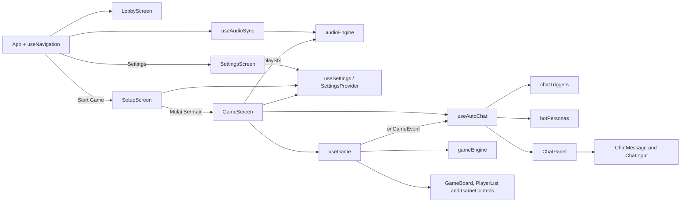

# Architecture

The application is a React single-page game. `src/main.jsx` mounts `App`, which only selects the active screen (via `useNavigation`). The lobby is the initial screen; `GameScreen` composes the board, controls, and chat UI and connects the game and chat hooks.

## Source layout

| Path | Responsibility |
| --- | --- |
| `src/screens/` | Top-level screens: `LobbyScreen`, `SetupScreen` (pre-game pawn and theme choice), `GameScreen`, `HowToPlayScreen`, `SettingsScreen`, `ExitScreen`. |
| `src/components/lobby/` | Lobby-specific UI such as the menu button. |
| `src/components/screens/` | Shared shell for secondary screens (title, back button). |
| `src/components/board/` | `BoardView` renders the themed 100-square board with `Connections` (ladders and snakes); `GameBoard` adds the player pawns on top. |
| `src/components/pawn/` | `Pawn` (shape, color, glossy finish) and `avatarArt.jsx` (the nine SVG characters). |
| `src/components/customize/` | `PawnCustomizer` and `ThemePicker`, shared by the setup screen and Settings. |
| `src/components/chat/` | Renders the group-chat panel, message bubbles, and message input. |
| `src/components/controls/` | Provides the dice, game actions, turn status, and the player list. |
| `src/audio/` | `audioEngine.js` (synthesized SFX and background music) and `useAudioSync` (connects settings to the engine). |
| `src/data/` | Holds board connections, bot personas, event-to-dialogue variations, pawn options, and the board theme list. |
| `src/engine/` | Implements dice, movement, turn-order, and snake/ladder rules (`gameEngine.js`) and pure board geometry (`boardGeometry.js`). |
| `src/settings/` | Global settings state: defaults and sanitizing (`settingsDefaults.js`), `SettingsProvider`, and the `useSettings` hook. Stores values only; sound is played by `src/audio`. |
| `src/components/settings/` | Reusable settings controls: `SettingsSection`, `VolumeSlider`, `ToggleSwitch`. |
| `src/hooks/` | Owns gameplay state, the queued automatic chat behavior, and screen navigation (`useNavigation`). |
| `src/styles/` | Shared theme tokens (`theme.css`) and the board, board-theme, and dice styles (`board.css`). |

## Game state and events

`useGame` receives the `players` list (built by `createPlayers` from the chosen pawn) and owns player positions, the active player, the last roll, movement state, the one-use bonus-roll state, and the winner. It uses `gameEngine.js` for dice results, per-square movement, turn rotation, and special-square resolution. Bot turns are scheduled after a thinking delay; the hook updates positions as the pawn moves and reports notable events through its `onGameEvent` callback.

The current event names are `DICE_SIX`, `CLUTCH_ZONE`, `LADDER_CLIMB`, `SNAKE_BITE`, and `GAME_OVER`. The application passes the chat hook's event handler into `useGame`.

`useGame` also reports sound moments through a separate `onSfx(name, options)` callback: `diceRoll`, `step` (with the step index within the move), `ladder`, `snake`, and `win`. The hook knows nothing about audio; `GameScreen` passes `playSfx`. A roll waits `DICE_ROLL_MS` before revealing the number, and a ladder or snake slide waits `SPECIAL_MOVE_MS`; the sound durations are written to fit those values.

## Settings state

`SettingsProvider` wraps `App` in `main.jsx` and holds user settings (`audio.master`, `audio.bgm`, `audio.sfx`, `audio.muted`, `visual.theme`, and `visual.pawn` with `avatar`, `shape`, and `color`). Any screen reads or updates them through `useSettings`. Input is always passed through `sanitizeSettings`, so invalid or corrupt stored data cannot crash the app, and changes persist to `localStorage`. The provider does not play sound. `useAudioSync` (mounted once in `App`) calls `getEffectiveVolume(audio, 'bgm' | 'sfx')` to get the final 0-1 volume (master and mute already applied) and passes it to the audio engine.

## Audio

`audioEngine.js` is a plain module (not React) built on the Web Audio API. Every sound is synthesized from oscillators and filtered noise, so there are no audio files. Browsers block audio until a user gesture, so `useAudioSync` creates and resumes the audio context on the first click, tap, or key press; until then every call is a safe no-op. The background music is a looping C-Am-F-G progression scheduled with a lookahead timer. It starts when the effective BGM volume is above zero, fades out when muted, and the whole context is suspended while the tab is hidden. `playSfx(name)` is silent when the effective SFX volume is zero. To add a sound, add a function to the `SFX` table and call `playSfx` with its name.

## Pawns and board themes

`Pawn` draws a colored base shape with a highlight gradient plus an SVG character from `avatarArt.jsx`. The player's choice (`visual.pawn`) is read once when `GameScreen` mounts and merged into the roster by `createPlayers`; the three bots keep fixed characters, shapes, and colors. The player palette excludes the bots' colors so pawns cannot be confused.

A board theme is a block of CSS variables in `styles/board.css` keyed by `[data-board-theme='id']`, plus an entry in `data/boardThemes.js`. `BoardView` sets the attribute; cells, ladders, and snakes read the variables. Ladder and snake shapes come from `engine/boardGeometry.js`. To add a theme, add both entries; no component changes are needed.

## Automatic chat flow

`useAutoChat` looks up event reactions in `chatTriggers.js`, resolves each reaction's author in `botPersonas.js`, substitutes the player's name, and appends the result to a queue. It displays the selected bot's typing state for 1-1.5 seconds before adding the message. The queue serializes reactions so only one bot types at a time. Human messages are appended immediately. `ChatPanel` renders the shared message state and scrolls its message viewport to the latest item.

