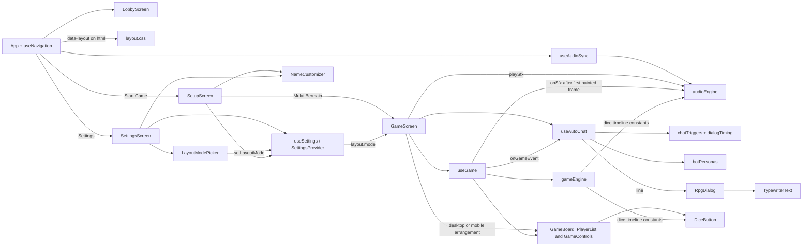

# Architecture

The application is a React single-page game. `src/main.jsx` mounts `App`, which only selects the active screen (via `useNavigation`). The lobby is the initial screen; `GameScreen` composes the board, controls, and the bot dialog box, connects the game and dialog hooks, and arranges them in the layout mode the player chose in Settings.

## Source layout

| Path | Responsibility |
| --- | --- |
| `src/screens/` | Top-level screens: `LobbyScreen`, `SetupScreen` (pre-game pawn and theme choice), `GameScreen`, `HowToPlayScreen`, `SettingsScreen`, `ExitScreen`. |
| `src/components/lobby/` | Lobby-specific UI such as the menu button. |
| `src/components/screens/` | Shared shell for secondary screens (title, back button). |
| `src/components/board/` | `BoardView` renders the themed 100-square board (for any `{ ladders, snakes }` board passed as `board`) with `Connections` (ladders and snakes) and can size itself to fit its parent (`fit`); `GameBoard` adds the player pawns on top. |
| `src/components/pawn/` | `Pawn` (shape, color, glossy finish) and `avatarArt.jsx` (the nine SVG characters). |
| `src/components/customize/` | `BoardPresetPicker` lists the board layout presets with a live preview, short description, and stats; `PlayerCompositionCustomizer` configures game mode, 2–4 player slots, Human/COM controls, bot difficulty, names, and each human's avatar/color; `NameCustomizer`, `PawnCustomizer`, and `ThemePicker` remain shared with Settings. |
| `src/components/chat/` | The RPG-style bot dialog: `RpgDialog` (portrait, name plate, text box) and `TypewriterText` (letter-by-letter typing). The player never types; there is no input. |
| `src/components/controls/` | Provides the 3D dice (`DiceButton`), game actions, turn status, and the player list. |
| `src/audio/` | `audioEngine.js` (synthesized SFX and background music) and `useAudioSync` (connects settings to the engine). |
| `src/data/` | Holds board connections (`boardData.js`, the original layout) and the board presets (`boardPresets.js`), bot personas, event-to-dialogue variations and their probabilities (`chatTriggers.js`), dialog timing (`dialogTiming.js`), layout modes (`layoutModes.js`), pawn options, player-name slots and defaults (`playerNames.js`), and the board theme list. |
| `src/engine/` | Implements dice, movement, turn-order, and snake/ladder rules (`gameEngine.js`), pure board geometry (`boardGeometry.js`), board validation, analysis and the random generator (`boardGenerator.js`), and the preset-to-board resolver (`boardResolver.js`). |
| `src/settings/` | Global settings state: defaults and sanitizing (`settingsDefaults.js`), `SettingsProvider`, and the `useSettings` hook. Stores values only; sound is played by `src/audio`. |
| `src/components/settings/` | Reusable settings controls: `SettingsSection`, `VolumeSlider`, `ToggleSwitch`, `LayoutModePicker` (Desktop / Mobile cards with a mini floor plan). |
| `src/hooks/` | Owns gameplay state, the queued automatic bot dialog (`useAutoChat`), and screen navigation (`useNavigation`). |
| `src/styles/` | Shared theme tokens (`theme.css`); the board, board-theme, and 3D dice styles (`board.css`); the RPG dialog box (`dialog.css`); and the app-wide layout-mode rules (`layout.css`). |

## Game state and events

`useGame` receives the `players` list (built by `createPlayers` from the saved player count, slot types, names, and per-slot pawn visuals) and owns player positions, the active player, the last roll, movement state, the one-use bonus-roll state, and the winner. It uses `gameEngine.js` for dice results, per-square movement, turn rotation, and special-square resolution. Bot turns are scheduled after a difficulty-dependent thinking delay; the hook updates positions as the pawn moves and reports notable events through its `onGameEvent` callback. Human turns, including multiple local players, wait for manual dice input; all-COM rosters advance automatically.

The current event names are `GAME_START` (fired by `useAutoChat` itself shortly after the screen mounts), `DICE_SIX`, `CLUTCH_ZONE`, `LADDER_CLIMB`, `SNAKE_BITE`, `OVERTAKE`, and `GAME_OVER`. `onGameEvent(name, player, extra)` carries an optional `extra`; `OVERTAKE` passes `{ target }`, the front-most opponent the move passed, found by the pure `findPassedPlayers` in `gameEngine.js`. `GameScreen` passes the dialog hook's `triggerEvent` into `useGame`.

`useGame` also reports sound moments through a separate `onSfx(name, options)` callback: `diceRoll`, `step` (with the step index within the move), `ladder`, `snake`, and `win`. The hook knows nothing about audio; `GameScreen` passes `playSfx`. A roll first waits for the browser to paint the frame that carries the animation class (`nextPaint`: two `requestAnimationFrame`s with a timer fallback for hidden tabs), then fires `diceRoll` and starts the `DICE_ROLL_MS` wait, so the sound, the CSS animation, and the reveal all start from the same frame and the class is only removed after the animation has actually finished. `useGame` also exposes `rollingValue` (the number being rolled) so the dice can show it at touchdown. A ladder or snake slide waits `SPECIAL_MOVE_MS`; the sound durations are written to fit those values.

## Settings state

`SettingsProvider` wraps `App` in `main.jsx` and holds user settings (`audio`, board theme, shared pawn fallback, per-slot pawn visuals, layout mode, names, and `game`). `game` stores `mode` (`single`, `local`, `spectator`, or `custom`), `playerCount` (2–4), four `playerTypes` (`human` or `bot`), bot `difficulty` (`easy`, `medium`, or `hard`), and `boardPreset` (a preset id from `boardPresets.js`; unknown or missing ids fall back to `classic`). `SetupScreen` writes these through `useSettings`; `GameScreen` snapshots the settings when it starts. Any screen reads or updates them through `useSettings`. Input is always passed through `sanitizeSettings`, so invalid or corrupt stored data cannot crash the app, and changes persist to `localStorage`. `names` stores what the person typed, where an empty string means "use the default name"; `resolveNames` (exposed as `playerNames` by `useSettings`) returns the trimmed final names with defaults filled in. `layout.mode` is what the player picked in Settings; when nothing is stored yet (first visit, or data saved before the option existed) `sanitizeSettings` falls back to `detectLayoutMode()`, a one-time guess from the viewport width (below 48rem means mobile). Once saved, the stored choice always wins and `App` mirrors it onto `<html data-layout>`. The provider does not play sound. `useAudioSync` (mounted once in `App`) calls `getEffectiveVolume(audio, 'bgm' | 'sfx')` to get the final 0-1 volume (master and mute already applied) and passes it to the audio engine.

## Board presets and the random generator

A board is `{ ladders: [{ start, end }], snakes: [{ start, end }] }`. `data/boardPresets.js` lists 11 presets (Classic Standard, Snake Pit, Heavenly Ladders, Chaos, The Final Wall, Long Range, Zig-Zag Trap, Short & Sweet, The Rollercoaster, Original Mini, and the procedural Random Generator). The player picks one in `SetupScreen` (`settings.game.boardPreset`); `GameScreen` calls `resolveBoard(presetId)` once when the game starts and passes the resulting board to `useGame` (through `resolveSpecialSquare(position, board)`) and to `GameBoard`/`BoardView`. The random preset generates a fresh board on every start and on every "Mulai ulang"; the header shows its `seed`, and `resolveBoard('random', { seed })` reproduces the same board.

`engine/boardGenerator.js` holds the rules, all pure functions:

- `validateBoard(board)` enforces the anti-loop rules: ladders go up and snakes go down (at least 3 squares), every square is the start of at most one connection (squares 1 and 100 never are), and no end may land on the start of another connection. That last rule means a snake head can never be wired straight to a ladder base (or the reverse), so chains and cycles are impossible. It also requires that from square 1 there is a dice path to square 100 and that no reachable square is a permanent trap (for example six consecutive snake heads).
- `analyzeBoard(board)` builds the dice transition graph (BFS forward from 1 and backward from 100) and returns reachability, trap squares, the fewest possible rolls, and the expected number of rolls (Gauss-Seidel on the Markov chain). The preset cards show the latter as an estimate of game length.
- `generateRandomBoard({ seed })` builds candidates with a seeded RNG (`mulberry32`), keeps only ones that pass `validateBoard`, and only accepts those whose expected rolls fall in a fair range (14-42). It returns `null` if nothing fits, and `resolveBoard` then falls back to the default board. A static preset that fails validation also falls back, with a `console.error`, so a typo in preset data cannot break the game.

`npm run verify:boards` checks every preset, runs the generator over 3,000 seeds, and confirms the validator rejects known-bad boards; it exits non-zero on any violation. To add a preset, append an entry to `BOARD_PRESETS` and run that script; no component changes are needed.

`npm run verify:audio` checks the theme-to-BGM mapping and the audio engine's crossfade behavior against a mocked `AudioContext`; the full-page theme backdrop lives in `src/components/layout/ThemeBackdrop.jsx` and `src/styles/backdrop.css`.

## Audio

`audioEngine.js` is a plain module (not React) built on the Web Audio API. Every sound is synthesized from oscillators and filtered noise, so there are no audio files. Browsers block audio until a user gesture, so `useAudioSync` creates and resumes the audio context on the first click, tap, or key press; until then every call is a safe no-op. The background music is a looping C-Am-F-G progression scheduled with a lookahead timer. It starts when the effective BGM volume is above zero, fades out when muted, and the whole context is suspended while the tab is hidden. `playSfx(name)` is silent when the effective SFX volume is zero. To add a sound, add a function to the `SFX` table and call `playSfx` with its name.

## Pawns and board themes

`Pawn` draws a colored base shape with a highlight gradient plus an SVG character from `avatarArt.jsx`. Each Human slot's name and pawn visuals are read once when `GameScreen` mounts and merged into the roster by `createPlayers`. COM slots keep their assigned bot visuals. A player can also choose an all-COM spectator roster; its bot turns run through the same turn engine. The player palette excludes the standard bots' colors so pawns cannot be confused.

A board theme is a block of CSS variables in `styles/board.css` keyed by `[data-board-theme='id']`, plus an entry in `data/boardThemes.js`. `BoardView` sets the attribute; cells, ladders, and snakes read the variables. Ladder and snake shapes come from `engine/boardGeometry.js`. To add a theme, add both entries; no component changes are needed.

## Layout modes

`GameScreen` renders one of two arrangements from `settings.layout.mode` and honors it as chosen instead of guessing from the viewport. The game content (hooks, board, controls, player list, dialog) is identical; only the composition differs.

- **Desktop:** `100dvh` tall and never scrolls vertically. A board column sized `min(100dvh - 5.5rem, 100% - 20rem)` sits next to a sidebar of 19-28rem holding the player list, the dice controls, and the bot dialog directly beneath them. `BoardView fit="fill"` fills a `relative` parent and sizes the board to `min(100cqw, 100cqh)` with container query units, so the 10x10 grid stays square; text, badges, and flags scale with the board width (`cqw`). The layout has a `56rem` minimum width, so on a narrow screen the page scrolls sideways, like a "desktop site" in a phone browser.
- **Mobile:** a single column capped at `30rem`: compact header, board (`BoardView fit="width"`, full width but no taller than `100dvh - 22rem`, at least `18rem`), dialog, a four-across compact `PlayerList`, then the dice at the bottom for thumb reach. The page scrolls vertically only when the screen is very short. `layout.css` additionally caps the whole app (lobby and settings included) to a phone-width column when this mode is active, so it looks the same on a wide monitor.

There is no media-query variant for this any more (the old `fit:` variant was removed); the mode is data in `layoutModes.js` and a `LayoutModePicker` in Settings.

## The 3D dice

`DiceButton` is a CSS 3D cube (six faces, opposite faces sum to 7). While `rolling`, the layers animate together: `.dice-shake` (rattling in the hand until the peak), `.dice-hop` (crouch, toss arc, and squash and stretch at each bounce), `.dice-cube` (rotation that ends on whole turns so the front face shows the result), plus `.dice-shadow`, `.dice-ring` (ripple on impact), and `.dice-glow` (result glow, gold for a 6). Only `transform` and `opacity` are animated and layers get `will-change` only while rolling, so it stays compositor-only. Faces show shuffled numbers at a slowing pace; at touchdown (`DICE_LAND_MS`) the front face switches to `target` (the real result, from `useGame.rollingValue`) and the number is readable while the die bounces to rest. When the button is enabled the die idles with a gentle bob and shrinks slightly when pressed. All motion is switched off under `prefers-reduced-motion`; numbers still change.

The timeline lives in `gameEngine.js` and is shared by three consumers: the peak (`DICE_PEAK_RATIO`, 35%), touchdown (`DICE_LAND_RATIO`, 68%), bounces (`DICE_BOUNCE_RATIOS`, 90% and 98.5%), and the rattle hits (`DICE_SHAKE_HITS`, fractions of the peak) are the same numbers in the `dice-*` keyframes in `board.css`, in the `diceRoll` SFX schedule in `audioEngine.js`, and in `DiceButton` (touchdown reveal). CSS cannot import JS, so the percentages are duplicated in the stylesheet with a comment; changing the timeline means updating the constants, the keyframes, and nothing else.

## Bot dialog flow

The player never sends messages: the dialog is a one-way, event-driven RPG box. `useAutoChat` receives an event from `useGame`, rolls the event's probability (`EVENT_CHANCE`; `DICE_SIX` and `OVERTAKE` do not always speak), looks up reactions in `chatTriggers.js`, and picks one whose bot is not the acting player or the target (falling back to any if none qualifies). The persona comes from `botPersonas.js` with the display name from its `names` option, and `{player}` and `{target}` are substituted. Only one line shows at a time: the current `line` stays for `getLineDuration(text)` (typing time plus a reading pause, from `dialogTiming.js`), then the next queued line replaces it, or the box clears when the queue is empty. The queue holds at most `MAX_QUEUED_LINES` (2, dropping the oldest) so dialog cannot lag behind play, and events in `INTERRUPT_EVENTS` (`GAME_OVER`) replace whatever is showing. A `GAME_START` greeting fires shortly after mount, and `onLine` (a stable callback from `GameScreen`) plays the `dialog` blip for each line.

`RpgDialog` renders the current line: the speaking bot's pawn art as the portrait (looked up in `players` by persona id) with the persona emoji as an expression badge, a name plate in the persona color, and `TypewriterText`. The slot keeps a fixed minimum height so the layout does not jump when lines appear and disappear. The typed text is `aria-hidden`; a visually hidden `role="status"` region announces the full line at once.

