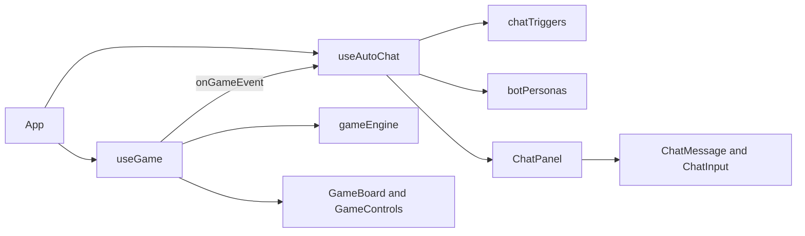

# Architecture

The application is a React single-page game. `src/main.jsx` mounts `App`, which composes the board, controls, and chat UI and connects the game and chat hooks.

## Source layout

| Path | Responsibility |
| --- | --- |
| `src/components/board/` | Renders the 100-square board, special-square markers, connections, and player pawns. |
| `src/components/chat/` | Renders the group-chat panel, message bubbles, and message input. |
| `src/components/controls/` | Provides dice and game actions, and displays turn status. |
| `src/data/` | Holds board connections, bot personas, and event-to-dialogue variations. |
| `src/engine/` | Implements dice, movement, turn-order, and snake/ladder rules as reusable functions. |
| `src/hooks/` | Owns gameplay state and the queued automatic chat behavior. |
| `src/styles/` | Defines shared theme tokens used by Tailwind and the application. |

## Game state and events

`useGame` owns player positions, the active player, the last roll, movement state, the one-use bonus-roll state, and the winner. It uses `gameEngine.js` for dice results, per-square movement, turn rotation, and special-square resolution. Bot turns are scheduled after a thinking delay; the hook updates positions as the pawn moves and reports notable events through its `onGameEvent` callback.

The current event names are `DICE_SIX`, `CLUTCH_ZONE`, `LADDER_CLIMB`, `SNAKE_BITE`, and `GAME_OVER`. The application passes the chat hook's event handler into `useGame`.

## Automatic chat flow

`useAutoChat` looks up event reactions in `chatTriggers.js`, resolves each reaction's author in `botPersonas.js`, substitutes the player's name, and appends the result to a queue. It displays the selected bot's typing state for 1-1.5 seconds before adding the message. The queue serializes reactions so only one bot types at a time. Human messages are appended immediately. `ChatPanel` renders the shared message state and scrolls its message viewport to the latest item.

